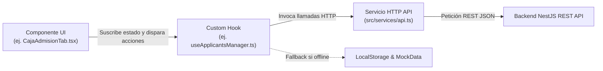

# 🏛️ Estándar Oficial de Desarrollo Frontend (`SFA-Frontend`)

Este documento define las **Normas y Estándares Oficiales de Arquitectura y Desarrollo** para el Frontend del **IESTP San Francisco de Asís**.

---

## 🎯 Patrón de Arquitectura: Feature-Based Domain Component Pattern

El proyecto utiliza una **Arquitectura basada en Características y Dominios (Feature-Driven Component Architecture)** combinada con el patrón **Custom Hooks Layer**, lo que garantiza alta cohesión, bajo acoplamiento y mantenimiento escalable.

---

## 📐 Estructura de Capas del Frontend

```text
src/
├── components/{dominio}/        # CAPA 1: PRESENTACIÓN (UI Components por Rol)
│   ├── index.ts                # Barrel exportador por dominio
│   └── tabs/                   # Sub-vistas y componentes de la interfaz
├── hooks/{dominio}/             # CAPA 2: LÓGICA DE NEGOCIO Y ESTADO (Custom Hooks)
│   ├── use{Feature}.ts         # Estado local, handlers y consumo de API
│   └── index.ts                # Barrel exportador de hooks por dominio
├── services/                    # CAPA 3: SERVICIOS DE COMUNICACIÓN (HTTP API)
│   ├── api.ts                  # Client HTTP wrapper (fetchJson) hacia NestJS
│   └── emailService.ts         # Integración con Brevo API
├── data/                        # CAPA 4: PERSISTENCIA Y FALLBACK
│   └── mockData.ts             # Datos semilla y fallback de resiliencia
├── types.ts                     # CAPA 5: DEFINICIONES DE TIPOS TS
└── App.tsx                      # Orquestador y enrutador condicional por rol
```

---

## 🔄 Flujo Interno de Datos en Frontend



---

## 📋 Reglas Obligatorias de Código y Git

1. **Importaciones:** Usar siempre exportaciones limpias desde archivos `index.ts` (Barrels).
2. **Formato de Commits:** Respetar la regla `[VERBO] + [OBJETO]` en español (`Agrega`, `Implementa`, `Integra`, `Refactoriza`, `Corrige`, `Actualiza`).
3. **Resiliencia:** Toda llamada API debe manejar fallos de red sin romper la interfaz de usuario.
