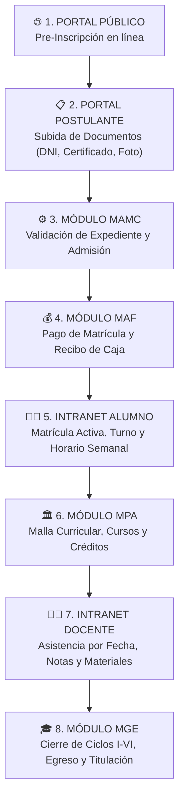

# 🔄 Flujo Operativo e Integración Institucional — IESTP San Francisco de Asís

Este documento detalla el **Flujo de Trabajo Institucional de Extremo a Extremo (End-to-End User Journey)** del sistema **SFA-Frontend** y **SFA-Backend**, describiendo la interacción entre los 8 roles, módulos del sistema y endpoints REST API.

---

## 📊 Diagrama de Flujo del Sistema

---

## 📋 Detalle Paso a Paso del Flujo Institucional

### 1. 🌐 Fase 1: Pre-Inscripción y Admisión
1. **Pre-Inscripción en Línea (Portal Público):** 
   - El postulante ingresa a la sección *Admisión*, selecciona su carrera técnica de interés y completa sus datos personales.
   - **Acción Backend:** Registra al postulante mediante `POST /applicants` en MongoDB y dispara el correo transaccional de bienvenida vía Brevo API.
2. **Carga de Expediente Digital (Portal Postulante):**
   - El postulante inicia sesión con su DNI y clave temporal (`clave123`).
   - Sube sus documentos digitales: DNI escaneado, Certificado de Secundaria y Foto Carné.

### 2. ⚙️ Fase 2: Validación, Matrícula y Pago
3. **Revisión de Expedientes y Admisión (Módulo MAMC):**
   - El personal de **MAMC** (*Admisión, Matriculación y Caja*) revisa la carpeta digital y física del postulante.
   - Cambia el estado del postulante a **`ADMITIDO`** (`PUT /applicants/:dni`).
4. **Pago de Matrícula y Prospecto (Módulo MAF):**
   - En Tesorería se registra el comprobante de caja (`POST /payments`).
   - El sistema actualiza el estado financiero a **`PAGADO`** y la matrícula a **`MATRICULADO`** (`PUT /enrollments/:dni`).
5. **Asignación de Aula y Turno (MAMC):**
   - Se le asigna turno (*Mañana / Noche*), aula física y grupo lectivo.

### 3. 🏛️ Fase 3: Planificación y Desarrollo Académico
6. **Planificación Curricular (Módulo MPA):**
   - La jefatura de **MPA** (*Planificación Académica*) configura el plan de estudios, créditos teóricos/prácticos y mallas por ciclo (I al VI).
7. **Control Docente (Intranet Docente):**
   - El profesor registra la asistencia diaria por fecha, evalúa las notas continuas y publica tareas y sílabos.
8. **Seguimiento del Estudiante (Intranet Alumno):**
   - El alumno consulta su horario semanal, sus notas en tiempo real y su avance porcentual de créditos.

### 4. 🎓 Fase 4: Egreso y Titulación
9. **Récord de Egresados (Módulo MGE):**
   - Al aprobar los 6 ciclos académicos (120+ créditos), el estudiante pasa al Módulo **MGE** (*Gestión Estudiantil y Egresados*).
10. **Titulación Profesional:**
   - Se emite el Certificado de Egresado y se tramita el Título Profesional a Nombre de la Nación.

---

## 🔑 Cuentas de Acceso por Módulo

| Módulo | Usuario / DNI | Contraseña | Descripción |
| :--- | :--- | :--- | :--- |
| 🔐 **SuperAdmin** | `superadmin` | `clave123` | Control total del sistema y gestión de usuarios en MongoDB. |
| ⚙️ **MAMC** | `mamc` | `clave123` | Admisión, caja y carpetas físicas de documentos. |
| 🏛️ **MPA** | `mpa` | `clave123` | Editor visual de mallas curriculares y cursos. |
| 🎓 **MGE** | `mge` | `clave123` | Registro de egresados y trámites de titulación. |
| 💰 **MAF** | `maf` | `clave123` | Tesorería, recibos de caja y estado de pagos. |
| 👨‍🏫 **Docente** | `docente` | `clave123` | Asistencia por fecha, evaluaciones y materiales. |
| 👨‍🎓 **Alumno** | `alumno` / `12345678` | `clave123` | Horario, récord de notas por ciclo (I al VI) y constancias. |
| 📋 **Postulante** | `postulante` | `clave123` | Carga de expediente y consulta de resultados. |

---

© 2026 **IESTP San Francisco de Asís** — Todos los derechos reservados.
